# Diseño

Funciones y características clave que el sistema debe incluir. Estas funcionalidades son esenciales para cumplir con los objetivos del proyecto.

## Navegación

> - MainRouter
>
> 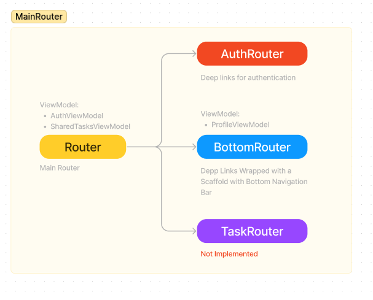
>
> - AuthRouter
>
> 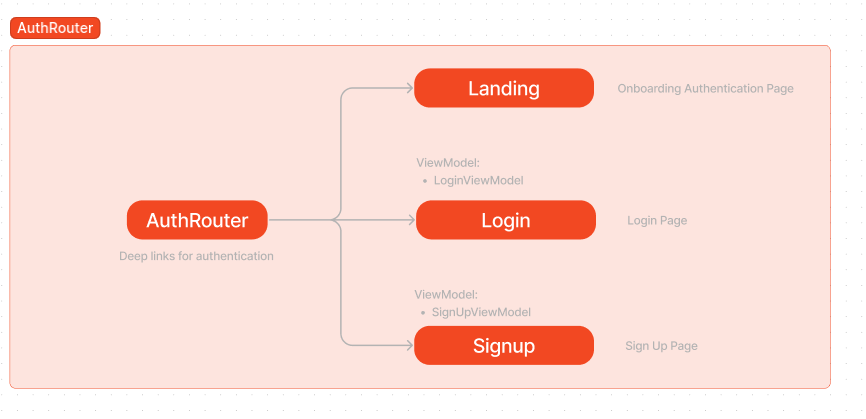
>
> - BottomRouter
>
> 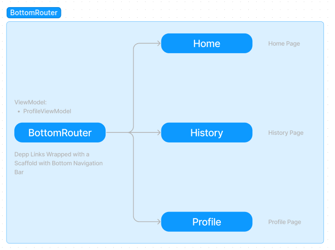
>
> - TaskRouter
>
> 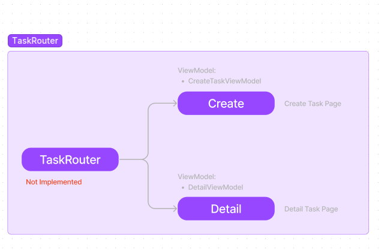

## ViewModels

> - AuthViewModel
>
> 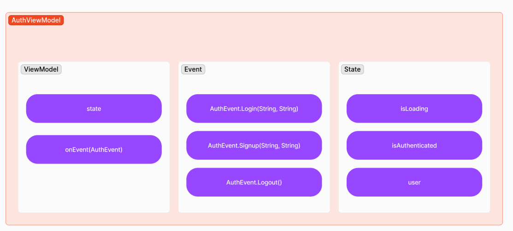
>
> - LoginViewModel
>
> 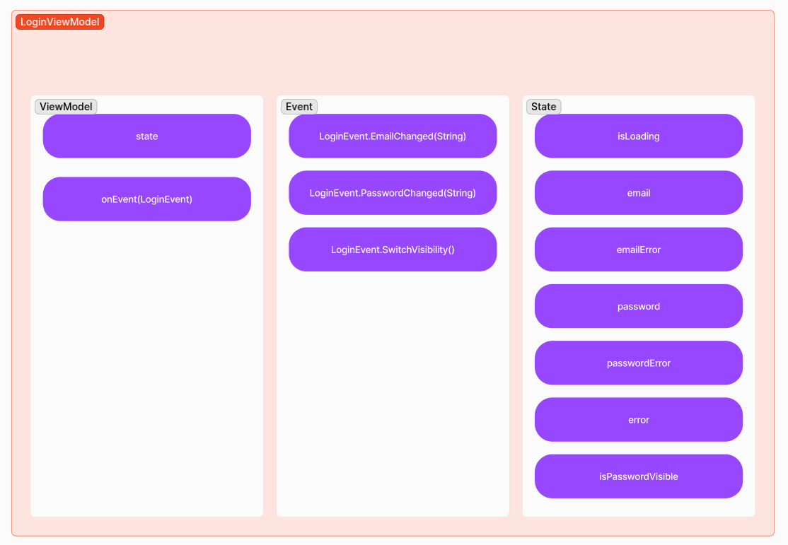
>
> - SignUpViewModel
>
> 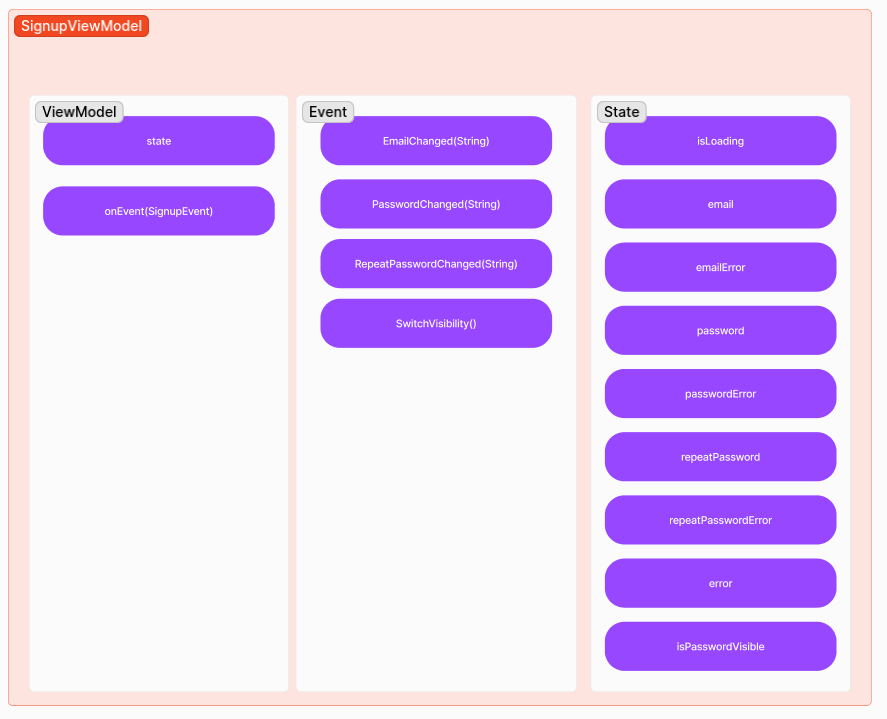
>
> - SharedTaskViewModel
>
> 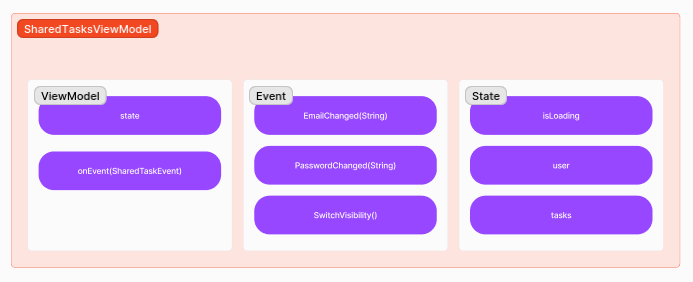
>
> - ProfileViewModel
>
> 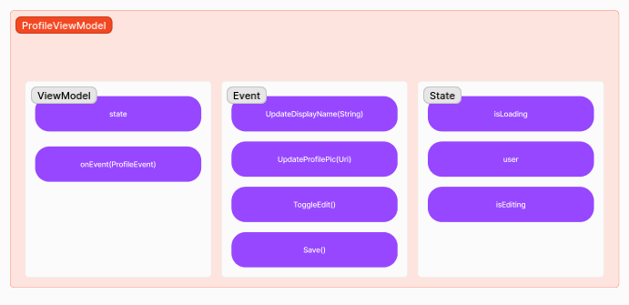
>
> - CreateTaskViewModel
>
> 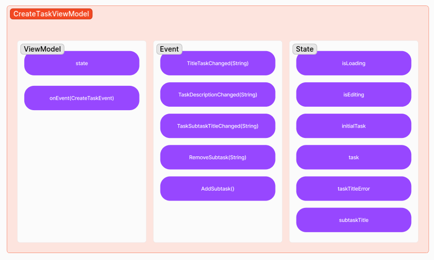
>
> - DetailTaskViewModel
>
> 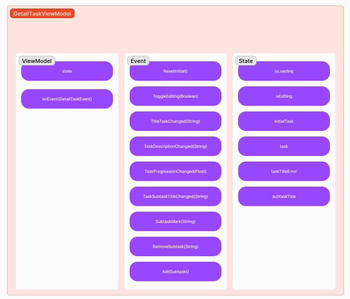
>